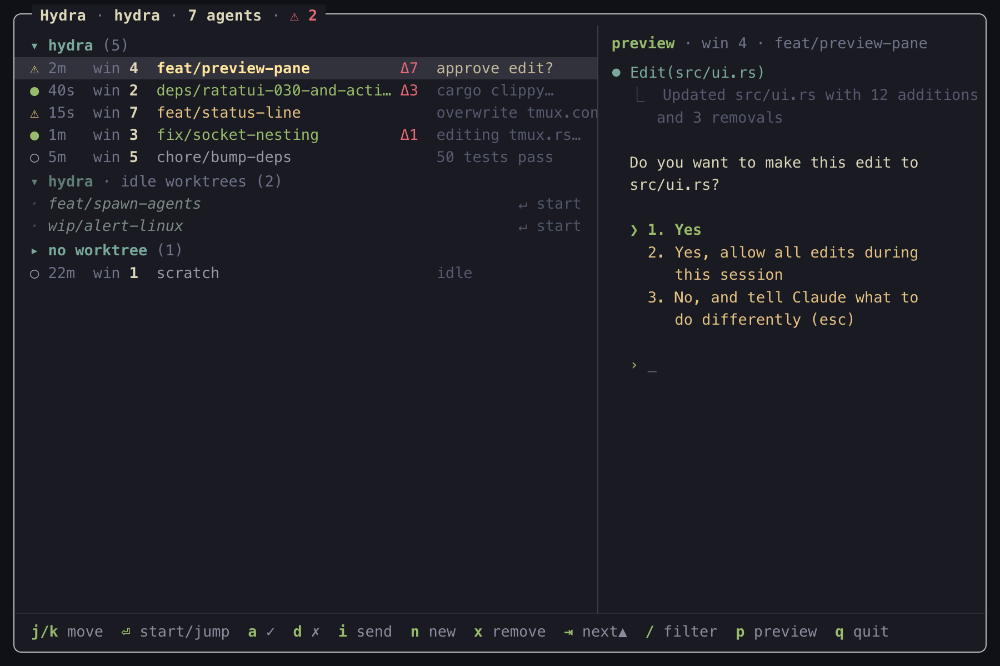

<div align="center">

# Hydra

**A tmux popup overseer for [Claude Code](https://claude.com/claude-code) agents.**

See every agent you're running — who's *working*, who *needs input*, who's *done* — and jump to any of them without leaving your keyboard.

[Install](#install) · [Quick start](#quick-start) · [Usage](#usage) · [Configuration](#configuration) · [How it works](#how-it-works) · [Contributing](#contributing)

[](https://github.com/guimochila/hydra/actions/workflows/ci.yml)
[](LICENSE)
[](https://www.rust-lang.org)

</div>

<p align="center">
  
</p>

Hydra is a single Rust binary — no daemon, no background service. It shows every Claude
Code agent running in your current tmux session, across all windows, with a live status,
the window it lives in, and its git worktree. Summon it from anywhere with a keybinding,
navigate with vim keys, and press `Enter` to jump. You can approve or deny a pending
prompt, send a message, and even spawn or tear down worktree-backed agents — all without
leaving the popup.

## Features

- 👁️ **One view of every agent** — every Claude Code agent in the current repo, across all
  your tmux sessions, grouped by git repo, with a live *working / needs-input / idle*
  status (`s` widens to every session on the server).
- ⌨️ **Vim-native navigation** — `j`/`k`, `gg`/`G`, `/` to filter, `Enter` to jump to an
  agent's window.
- ✅ **Act without switching** — approve (`a`), deny (`d`) or pick an option (`1`–`3`)
  on a pending prompt, or send a message (`i`) to any agent from the popup.
- 🌱 **Spawn & reap worktrees** — `n` creates a git worktree on a fresh branch and starts
  an agent in it; `x` tears a worktree down when you're done.
- 🔔 **Attention alerts** — a desktop notification the moment an agent needs your input,
  so you don't have to babysit the popup.
- 📊 **Status-line indicator** — a daemon-free `⚠ N NEEDS INPUT` badge in your tmux status
  bar, updated by polling.
- 🪶 **No scraping, no daemon** — state is pushed by Claude Code hooks and joined against
  live tmux; a dead pane just disappears. Nesting works because every call is
  socket-scoped.

## Install

> **Requirements:** [Rust](https://www.rust-lang.org/tools/install) (stable) and
> [tmux](https://github.com/tmux/tmux).

### From source

```sh
git clone https://github.com/guimochila/hydra.git
cd hydra
cargo build --release
cp target/release/hydra ~/.local/bin/   # or anywhere stable on your PATH
~/.local/bin/hydra install              # adds Claude Code hooks + a tmux popup binding
tmux source-file ~/.tmux.conf
```

> `install` bakes the binary's **absolute path** into the hooks and tmux binding, so
> run it from a stable location (not a `target/` build dir that moves on rebuild).
> If you move the binary later, just re-run `hydra install` from the new path.

### Prebuilt binaries

Grab a binary for your platform from the [latest release](https://github.com/guimochila/hydra/releases/latest)
(Linux and macOS, x86_64 and aarch64), then run `hydra install` as above.

### What `install` touches (non-destructive & reversible)

- Merges its hooks into `~/.claude/settings.json` **alongside** any you already have
  (a backup is written first).
- Appends a popup binding and a status-line indicator to `~/.tmux.conf` inside a
  marker-delimited block, using `set -ga status-right` so your existing status line is
  preserved.

Undo everything with `hydra uninstall`.

## Quick start

```sh
# 1. Start (or attach to) a tmux session and run Claude Code in a window:
tmux new -s work
claude

# 2. From any window in that session, open Hydra:
#    press your tmux prefix, then `a`
```

You'll see every agent in the session. Move with `j`/`k`, press `Enter` to jump to one,
press `n` to spawn a new worktree-backed agent, and `q` to dismiss the popup.

## Usage

Open the popup with **`prefix` + `a`** (your tmux prefix, then `a`).

| Key | Action |
|-----|--------|
| `j` / `k`, arrows | move |
| `gg` / `G` | first / last |
| `Tab` | jump selection to the next agent needing input |
| `Enter` | jump to the agent's window — or, on an idle worktree, start `claude` there |
| `a` | approve a pending prompt (accept the highlighted default) |
| `d` | deny a pending prompt (Escape) |
| `1`–`3` | pick option N of a multi-option prompt (sends the digit) |
| `i` | send a message to the agent |
| `n` | spawn a new agent: worktree + tmux window running `claude` |
| `x` | remove the selected worktree (confirm with `y`) |
| `p` | toggle the preview pane |
| `s` | toggle scope: this repo (across all sessions) ⟷ every session on this tmux server |
| `/` | filter (branch / repo / summary / window) |
| `r` | refresh |
| `q` / `Esc` | quit (Esc clears an active filter first) |

`a`/`d`/`1`–`3` only act when the selected agent is actually waiting for input — the
state file is re-checked at the last moment so a keystroke can't land on an agent
that already moved on. The filter/send/spawn inputs support `Ctrl-U` (clear) and
`Ctrl-W` (delete word).

Each row shows the agent's status glyph, how long it's been in that state (`4m`), its
window number, branch, an uncommitted-change count (`Δ3`), and its last prompt —
replaced, while the agent waits, by *why* it needs input (the notification message,
e.g. "Claude needs your permission to use Bash"). The preview pane (right) shows a
live snapshot of the selected agent's screen, in color.

The list also includes **existing worktrees that have no agent yet**, shown dimmed
under their repo — for every repo in view (each agent's repo plus the one the popup
was opened from). Press `Enter` on one to start `claude` in it — so you can pick up
a worktree you created earlier without leaving Hydra. `git worktree list` is the
source, so worktrees are found wherever they live.

### Notifications

When an agent transitions into "needs input", Hydra fires a desktop notification —
including the reason — so you don't have to watch the popup. On macOS it uses the
built-in `osascript` (`display notification`); on Linux/Windows it uses the
cross-platform [`notify-rust`](https://crates.io/crates/notify-rust) library (zbus on
Linux/BSD). Set `HYDRA_ALERTS=0` to disable.

### Removing worktrees

`x` removes the selected worktree when the work is done, after a `y/N` confirm. If the
worktree has a running agent, its tmux window is killed first. Uncommitted changes are
surfaced in the prompt and require confirming a forced removal. The **branch is kept**
(`git worktree remove` only) and the main/current worktree can't be removed.

### Spawning agents

`n` creates a git worktree on a new branch off the repo's default branch, then opens a
tmux window running `claude` in it. Worktrees go under `~/work/tree/<name>` by default;
override with `HYDRA_WORKTREE_ROOT`. Spawning anchors on an existing agent to locate
the repo and session — or, when there is none yet, on the directory the popup was
opened from (it just has to be inside a git repo).

## Configuration

Hydra reads an optional TOML config from `~/.config/hydra/config.toml` (override the path
with `$HYDRA_CONFIG`). Without a config, Hydra uses its built-in defaults — nothing to set
up. `hydra install` writes a commented starter file with every default if none exists.

Most settings are read at runtime, so a rebuild isn't needed to pick them up. The one
exception is `[popup]` (key/size), which is baked into `~/.tmux.conf` by `install` — after
changing it, re-run `hydra install` and `tmux source-file ~/.tmux.conf`.

Precedence: built-in defaults → config file → environment variables
(`HYDRA_WORKTREE_ROOT`, `HYDRA_ALERTS`) win on top. A leading `~` in `worktree_root`
(including via `HYDRA_WORKTREE_ROOT`) is expanded to the home directory.

```toml
[timings]
stale_after_secs       = 900   # WORKING agent silent this long → UNKNOWN
refresh_ms             = 250   # popup refresh tick
dirty_ttl_secs         = 3     # throttle for git-status dirty counts
worktree_list_ttl_secs = 5     # throttle for git worktree list

[agent]
command       = "claude"       # launched by `n` (spawn) and Enter (start in worktree)
worktree_root = "~/work/tree"  # where spawned worktrees go
spawn_mode    = "window"       # "window" or "session" — see below

[popup]                        # re-run `hydra install` after changing
key    = "a"
width  = "70%"
height = "60%"

[theme.tui]                    # a color name ("green") or "#rrggbb"
highlight_bg = "#32323c"
working      = "green"
needs_input  = "yellow"
idle         = "gray"
unknown      = "darkgray"
footer_key   = "green"         # shortcut keys in the footer keybar
footer_label = "gray"          # the descriptions next to each footer key
header       = "blue"          # repo group headers
branch       = "cyan"          # branch names in agent rows
dirty        = "magenta"       # the uncommitted-change count (Δ3)
worktree_row = "darkgray"      # idle-worktree rows (glyph + "start ⏎")

[theme.status]                 # status-bar palette
label    = "#b35b79"
working  = "#5e857a"
idle     = "#d9a594"
alert_fg = "#f2ecbc"
alert_bg = "#d7474b"
unknown  = "#b35b79"

[alerts]
enabled = true                 # HYDRA_ALERTS=0 also disables
```

### `spawn_mode`: window vs. session

Controls how `n` (spawn) and `Enter` (start an idle worktree) open a new agent:

- **`"window"`** (default) — each agent opens as a new window in the current tmux
  session. This is today's behavior.
- **`"session"`** — each worktree gets its own dedicated tmux session with two windows:
  a shell (1) and the agent (2). `Enter` switches to that session, landing on the agent
  window; `n` stays in the popup so you can spawn several in a row. `x` tears the whole
  session down (both windows are rooted in the worktree, so killing them destroys the
  now-empty session). In this mode the popup opens in all-sessions view (`s` still
  toggles it) so the new sessions are visible.

## How it works

Hydra never scrapes terminal output. Instead:

1. **Claude Code hooks push state.** `hydra install` registers hooks that run
   `hydra hook <event>` on each lifecycle event. Each agent self-reports its tmux socket,
   pane, cwd, and status into a per-pane JSON file in a runtime dir — keyed by
   `$TMUX_PANE`.
2. **tmux says where things are.** The popup joins those state files against
   `tmux list-panes` by pane id. A dead pane's leftover file matches nothing and simply
   disappears — no ghosts.
3. **Git says which worktree.** Each agent's cwd resolves to a branch/repo, and agents are
   grouped under their repo.

Status comes from the hook events: `UserPromptSubmit`/`PreToolUse`/`PostToolUse` →
working, `Notification` → needs input, `Stop` → idle, `SessionEnd` → gone.

## Commands

```
hydra                    Open the popup TUI
hydra ls                 Print the agent list (headless; for debugging)
hydra status <sock> <s>  Print the status-line indicator for a session
hydra hook <event>       Record a Claude Code lifecycle event (used by hooks)
hydra install            Install hooks + tmux popup keybinding + status indicator
hydra uninstall          Remove everything Hydra installed
hydra version            Print the hydra version
```

## Contributing

Contributions are welcome. CI runs on every pull request and on pushes to `main`; before
pushing, mirror what CI checks so you get a green build:

```sh
cargo fmt --all -- --check      # formatting (CI fails on diffs)
cargo clippy --all-targets      # lints (CI treats warnings as errors)
cargo test                      # the pure logic layers are unit-tested
```

Workflows live in `.github/workflows/`:

- **`ci.yml`** — `fmt` + `clippy` on Ubuntu, then `build` + `test` on Ubuntu and macOS.
- **`release.yml`** — on a `v*` tag, builds Linux and macOS binaries (x86_64 + aarch64)
  and attaches them to a GitHub Release. Cut a release with `git tag v0.1.0 && git push --tags`.

Dependencies (crates and Actions) are kept current by [Dependabot](.github/dependabot.yml).

<details>
<summary>Recommended branch protection</summary>

To enforce green-before-merge, enable branch protection on `main`
(Settings → Branches → Add rule) and mark these status checks as **required**:

- `fmt + clippy`
- `test (ubuntu-latest)`
- `test (macos-latest)`

Also enable *"Require branches to be up to date before merging"* and *"Require a pull
request before merging"*.

</details>

## License

Licensed under the [MIT License](LICENSE).
